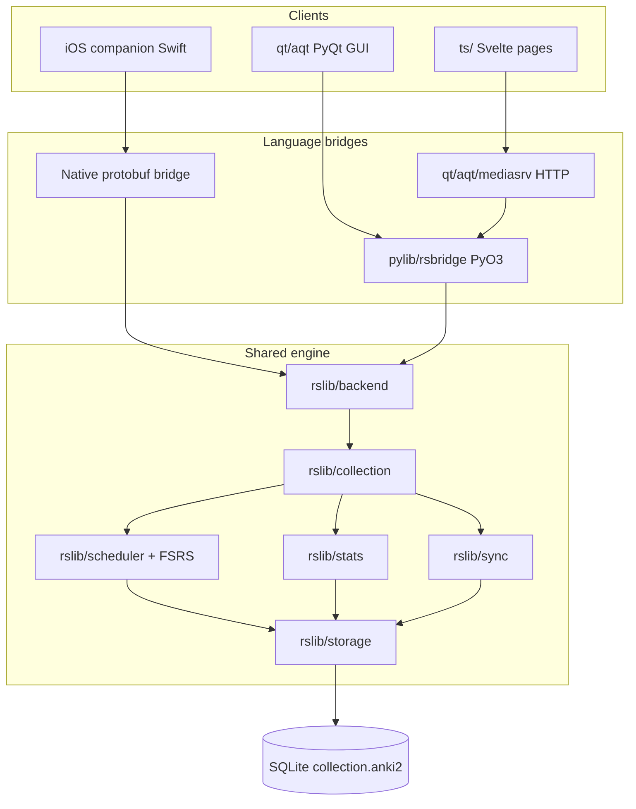
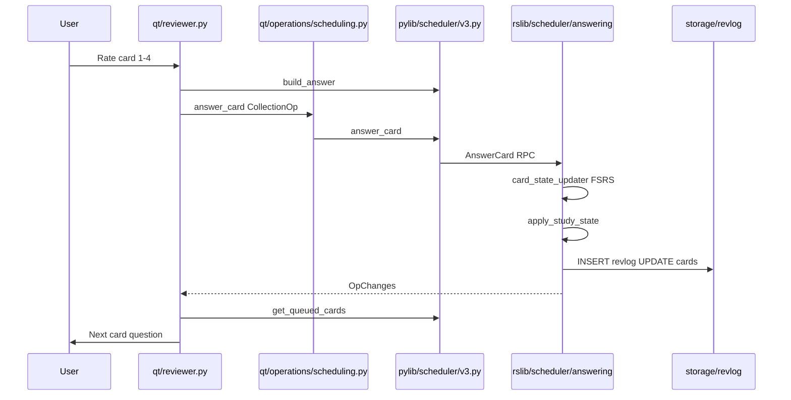

# BrainLift: Anki Codebase Architecture Guide

This document implements the architecture learning plan for modifying Anki in-place for GRE prep. It covers all nine subsystems, with detailed walkthroughs from the codebase. **No code has been changed** — this is a read-only map.

**Exam:** GRE (Verbal 130–170, Quant 130–170, section-adaptive)

---

## Repository Map

```
anki/
├── rslib/          Rust core — collection, scheduler, sync, stats, storage
├── pylib/          Python library + rsbridge (PyO3 → Rust)
├── qt/aqt/         PyQt6 desktop GUI
├── ts/             Svelte/TypeScript web UI (embedded in Qt WebEngine)
├── proto/anki/     Protobuf RPC contract (Rust, Python, TS codegen)
├── build/          Ninja configure + build runner
├── ftl/            Fluent translations
├── out/            Build artifacts (generated code, pyenv, wheels)
└── docs/           Contributor + BrainLift docs
```



---

## 1. Python Frontend

### Purpose

Desktop application shell. PyQt6 renders windows and embedded web views. Python exposes the public `Collection` API. **Scheduling logic is not here** — it lives in Rust.

### Responsibilities

- App lifecycle, profiles, add-on loading
- Screen state machine: deck browser → overview → review
- Background threading for DB mutations (`CollectionOp`)
- Webview bridge (`pycmd` handlers)
- Thin wrappers around Rust RPCs

### Important files

| Area             | Path                                                               |
| ---------------- | ------------------------------------------------------------------ |
| App entry        | `qt/aqt/__init__.py`, `qt/aqt/main.py` (`AnkiQt`, global `mw.col`) |
| Review UI        | `qt/aqt/reviewer.py`                                               |
| Study flow       | `qt/aqt/deckbrowser.py`, `qt/aqt/overview.py`                      |
| Background ops   | `qt/aqt/operations/__init__.py`, `qt/aqt/taskman.py`               |
| Web bridge       | `qt/aqt/webview.py`, `qt/aqt/mediasrv.py`                          |
| Collection API   | `pylib/anki/collection.py`                                         |
| Scheduler facade | `pylib/anki/scheduler/v3.py`                                       |
| Rust bridge      | `pylib/anki/_backend.py`, `pylib/rsbridge/lib.rs`                  |

### Request flow

GUI code calls `mw.col.*` or `CollectionOp` → `col._backend.*` → `_rsbridge.command(service_idx, method_idx, bytes)`.

### Data flow

- **Reads:** `col.get_card()`, search, stats → Rust RPC or dbproxy
- **Writes:** Always via `CollectionOp` on a worker thread; returns `OpChanges` telling UI what to refresh
- **Rendering:** Card HTML from Rust (`render_existing_card`), then Python hooks may modify it

### BrainLift relevance

- Hook review via `qt/aqt/gui_hooks.py` (`card_will_show`, `reviewer_did_answer_card`) for transfer-question logging
- Readiness dashboard: new Svelte page in `ts/routes/` (matches Anki's direction)
- GRE deck content: note types in `pylib/anki/models.py`; topic tags drive coverage map
- **Rule:** GUI never calls `_backend` directly; add public `Collection` methods wrapping new Rust RPCs

---

## 2. Rust Backend (`rslib/`)

### Purpose

Authoritative domain layer: SQLite, FSRS scheduling, sync, stats, search, undo. Every client (desktop, web, iOS) calls into here.

### Responsibilities

- Open/close collection, transactions, undo stack
- Build study queues, answer cards, write revlog
- FSRS memory state and parameter optimization
- Sync merge (USN-based)
- Graph/stats computation
- Protobuf service implementations

### Important files

| Area          | Path                                               |
| ------------- | -------------------------------------------------- |
| Module root   | `rslib/src/lib.rs`                                 |
| Collection    | `rslib/src/collection/mod.rs`, `transact.rs`       |
| Backend shell | `rslib/src/backend/mod.rs`                         |
| RPC dispatch  | `rslib/src/services.rs`, `rslib/rust_interface.rs` |
| Undo          | `rslib/src/undo/mod.rs`, `rslib/src/ops.rs`        |

### Request flow

```
Protobuf bytes → Backend::run_service_method(service_idx, method_idx, input)
  → generated match → Collection-scoped or Backend-scoped trait method
  → domain logic → storage SQL → protobuf bytes out
```

### Data flow

All durable writes go through `Collection::transact()` → domain module → `storage/*` → SQLite. Undo records reversible changes before commit.

### BrainLift relevance

**Required Rust change belongs here.** Examples:

- **Mastery query** → extend `rslib/src/stats/` + `proto/anki/stats.proto`
- **Topic-aware scheduling** → extend `rslib/src/scheduler/queue/` + `proto/anki/scheduler.proto`

Do **not** reimplement FSRS in Python. Do **not** bypass `transact()` (breaks undo and sync).

---

## 3. SQLite Collection

### Purpose

Persistent store per user profile: `collection.anki2` + media folder + media DB.

### Key tables

| Table                   | Stores                                                    |
| ----------------------- | --------------------------------------------------------- |
| `notes`                 | Content (`flds`), tags, notetype id                       |
| `cards`                 | Scheduling (`due`, `ivl`, `queue`), FSRS `data` JSON blob |
| `revlog`                | Every review (rating, interval, time taken)               |
| `decks` / `deck_config` | Deck tree, FSRS params, daily limits                      |
| `notetypes`             | Templates and fields                                      |
| `graves`                | Deletion tombstones for sync                              |
| `col`                   | Metadata, schema version, last sync                       |

Schema base: `rslib/src/storage/schema11.sql`. Migrations: `rslib/src/storage/upgrades/`. Current max version: 18.

### Data flow

Answer card → scheduler updates `cards` row + inserts `revlog` row → `set_modified()` bumps mtime and row USNs → sync exchanges changed rows.

### BrainLift relevance

- **Memory model input:** `revlog` + FSRS state in `cards.data` (see `rslib/src/storage/card/data.rs`: `fsrs_stability`, `fsrs_difficulty`, `custom_data`)
- **Performance model input:** Store transfer-question results in note tags, `cards.custom_data`, or collection config — not side databases
- **Coverage map:** Join `notes.tags` against GRE topic taxonomy
- **Give-up rule data:** Count revlog rows, distinct tags covered, calibration sample size

---

## 4. Scheduler + FSRS

### Purpose

Decide which cards are due, in what order, and what happens when the user rates them. FSRS predicts memory stability and optimal intervals.

### Important files

| Area        | Path                                       |
| ----------- | ------------------------------------------ |
| Answer path | `rslib/src/scheduler/answering/mod.rs`     |
| FSRS memory | `rslib/src/scheduler/fsrs/memory_state.rs` |
| FSRS params | `rslib/src/scheduler/fsrs/params.rs`       |
| Queues      | `rslib/src/scheduler/queue/`               |
| RPC         | `rslib/src/scheduler/service/mod.rs`       |
| Contract    | `proto/anki/scheduler.proto`               |

### FSRS integration point (critical for BrainLift memory score)

When a card is answered, `card_state_updater()` in `answering/mod.rs` (~line 441):

1. Loads deck config and checks `BoolKey::Fsrs`
2. If FSRS enabled and card has no memory state: reconstruct from revlog via `fsrs_item_for_memory_state()`
3. Calls `fsrs.next_states(card.memory_state, desired_retention, days_elapsed)` → four button outcomes
4. Injects `fsrs_next_states` into `StateContext` used by state transition code
5. Updated memory state written back to `cards.data` on `update_card_inner()`

Key RPCs in `scheduler.proto`:

- `GetQueuedCards` — fetch next card(s) + counts
- `AnswerCard` — persist rating and reschedule
- `ComputeMemoryState` — on-demand FSRS state for one card
- `ComputeFsrsParams` — optimize parameters from revlog

### BrainLift relevance

- **Memory score:** Surface `fsrs_retrievability` from `CardStatsResponse` in `stats.proto` — already computed in Rust
- **Study feature (interleaving):** Topic-aware queue ordering belongs in `scheduler/queue/`, not Python sort
- **Performance is NOT the scheduler:** GRE-style questions are a separate assessment layer
- **Undo requirement:** Any scheduler change must use `transact(Op::AnswerCard, ...)`

---

## 5. Sync Engine

### Purpose

Keep collection and media consistent across devices (desktop ↔ iOS) via AnkiWeb or self-hosted sync server.

### Important files

| Area          | Path                                  |
| ------------- | ------------------------------------- |
| Orchestration | `rslib/src/sync/collection/normal.rs` |
| Chunks        | `rslib/src/sync/collection/chunks.rs` |
| HTTP client   | `rslib/src/sync/http_client/mod.rs`   |
| Backend entry | `rslib/src/backend/sync.rs`           |
| Contract      | `proto/anki/sync.proto`               |

### Normal sync flow (`normal_sync_inner`)

```
1. start_and_process_deletions  — exchange graves (tombstones)
2. process_unchunked_changes    — small metadata updates
3. process_chunks_from_server   — pull remote deltas
4. send_chunks_to_server        — push local deltas
5. sanity_check                 — verify counts match
6. finalize                     — update lastSync, USN, mtime
```

All inside a SQLite transaction; rollback + server abort on failure.

### Conflict model

Each row has a **USN** (update sequence number). Sync exchanges increments since last sync. Pending local changes use `usn = -1` until finalized. For BrainLift Friday deadline: document your rule when the same card is reviewed offline on two devices (likely latest timestamp / server merge during chunk apply).

### BrainLift relevance

- Use existing sync — do not rewrite unless necessary
- New BrainLift data (performance logs) must sync as notes/cards/config rows
- Revlog entries sync via chunks — phone reviews appear on desktop automatically after sync

---

## 6. Review Pipeline (Full Trace)

This section completes todo #1: trace one review from UI to revlog.

### User journey

```
DeckBrowser → Overview ("Study Now") → Review (question → answer → rate) → Overview (when empty)
```

### Step-by-step with file references

| Step | Location                                   | What happens                                                        |
| ---- | ------------------------------------------ | ------------------------------------------------------------------- |
| 1    | `qt/aqt/overview.py`                       | User clicks Study → `mw.moveToState("review")`                      |
| 2    | `qt/aqt/reviewer.py:247`                   | `nextCard()` clears state, calls `_get_next_v3_card()`              |
| 3    | `qt/aqt/reviewer.py:265`                   | `col.sched.get_queued_cards()`                                      |
| 4    | `pylib/anki/scheduler/v3.py:55`            | `col._backend.get_queued_cards()`                                   |
| 5    | `rslib/src/scheduler/service/mod.rs:243`   | `SchedulerService.GetQueuedCards` → queue builder queries storage   |
| 6    | `qt/aqt/reviewer.py:271`                   | Builds `Card` from protobuf, starts timer                           |
| 7    | `qt/aqt/reviewer.py`                       | `_showQuestion()` → `card.question()` → Rust `render_existing_card` |
| 8    | User                                       | Shows answer, presses 1–4                                           |
| 9    | `qt/aqt/reviewer.py:533`                   | `_answerCard(ease)` — hook `reviewer_will_answer_card`              |
| 10   | `pylib/anki/scheduler/v3.py:66`            | `build_answer()` → `CardAnswer` protobuf                            |
| 11   | `qt/aqt/operations/scheduling.py:284`      | `answer_card(CollectionOp)` → background thread                     |
| 12   | `pylib/anki/scheduler/v3.py:94`            | `answer_card_raw(SerializeToString())`                              |
| 13   | `rslib/src/scheduler/service/mod.rs:232`   | `SchedulerService.AnswerCard`                                       |
| 14   | `rslib/src/scheduler/answering/mod.rs:311` | `transact(Op::AnswerCard, answer_card_inner)`                       |
| 15   | `answering/mod.rs:315`                     | Validate state, FSRS next states, apply transition                  |
| 16   | `answering/mod.rs:335`                     | `apply_study_state()` → `RevlogEntryPartial`                        |
| 17   | `answering/mod.rs:336`                     | `add_partial_revlog()` → `add_revlog_entry_undoable()`              |
| 18   | `answering/mod.rs:354`                     | `update_card_inner()` — new due date, FSRS memory in `cards.data`   |
| 19   | `answering/mod.rs:374`                     | `update_queues_after_answering_card()`                              |
| 20   | Returns                                    | `OpChanges` → UI refreshes → `nextCard()` loop                      |

### Sequence diagram



### Revlog row contents

Built in `rslib/src/scheduler/answering/revlog.rs`:

- `id` = answer timestamp (ms)
- `cid`, `button_chosen` (1–4), `interval`, `lastIvl`, `ease_factor`, `time` (ms taken), `type` (review kind)
- `usn` for sync

---

## 7. Database Layer

### Purpose

Abstract SQLite behind typed query modules in `rslib/src/storage/`.

### Pattern

```
Domain method → storage/{entity}/mod.rs → .sql files via include_str! → SqliteStorage connection
```

Entity modules: `card/`, `note/`, `deck/`, `notetype/`, `revlog/`, `tag/`, `config/`, `deckconfig/`.

Legacy escape hatch: Python `col.db` → JSON dbproxy in `rslib/src/backend/dbproxy.rs`. Prefer typed RPCs for new BrainLift features.

### BrainLift relevance

Mastery query at 50k cards: add SQL aggregation in `storage/card/` with proper indexes — why it belongs in Rust, not Python loops.

---

## 8. Protobuf Communication

### Purpose

Stable API contract. Changing a `.proto` file regenerates Rust traits, Python `_backend_generated.py`, and TS `@generated/backend`.

### Service pattern

Each domain file defines two paired services:

- `FooService` — collection-scoped (requires open DB)
- `BackendFooService` — backend-only (sync, open/close)

Codegen: `rslib/proto/build.rs` → outputs in `out/pylib/`, `out/ts/lib/generated/`.

### Three transport paths, same RPC indices

| Client     | Transport                                                                       |
| ---------- | ------------------------------------------------------------------------------- |
| Python/Qt  | `_rsbridge.command()` in `pylib/rsbridge/lib.rs`                                |
| TypeScript | `POST /_anki/{method}` → `col._backend.{method}_raw()` via `qt/aqt/mediasrv.py` |
| iOS        | Same bytes through native bridge into `run_service_method`                      |

Example TS call (`ts/routes/graphs/WithGraphData.svelte`):

```typescript
sourceData = await graphs({ search, days });
// → POST /_anki/graphs with GraphsRequest protobuf
```

### BrainLift: adding a new capability

1. Add message + RPC to appropriate `.proto` (e.g. `stats.proto` for mastery query)
2. Implement trait in `rslib/src/*/service.rs`
3. Rebuild: `./ninja pylib qt`
4. Expose via Python `Collection` method and/or TS `@generated/backend`

This ships the same Rust change to desktop and iOS.

---

## 9. Build System

### Purpose

Incremental builds via Ninja. Configure generates `build.ninja`; runner executes targets.

### Commands

| Command                        | Effect                                 |
| ------------------------------ | -------------------------------------- |
| `./ninja pylib qt`             | Build Rust bridge + Python + Qt assets |
| `./run`                        | Build if needed, launch Anki dev mode  |
| `./ninja check` / `just check` | Full format + build + tests            |
| `./ninja rslib:proto`          | Regenerate protobuf bindings only      |

Outputs in `out/` — never edit generated files by hand.

---

## 10. Stats Subsystem (Mastery Query Placement)

### Current surface (`proto/anki/stats.proto`)

| RPC                                           | Purpose                                |
| --------------------------------------------- | -------------------------------------- |
| `CardStats`                                   | Per-card stats + `fsrs_retrievability` |
| `GetReviewLogs`                               | Full revlog for one card               |
| `Graphs`                                      | Browser stats page datasets            |
| `GetGraphPreferences` / `SetGraphPreferences` | UI prefs                               |

Implementation: `rslib/src/stats/service.rs` delegates to `stats/card.rs` and `stats/graphs/mod.rs`.

### Graph data pipeline

```
StatsService.Graphs(search, days)
  → search_cards_into_table (temporary filter)
  → load revlog + cards from storage
  → graphs/*.rs builds protobuf datasets (retention, retrievability, true_retention, ...)
```

Existing `retrievability` graph (`stats/graphs/retrievability.rs`) already aggregates FSRS retrievability — useful reference for memory calibration display.

### Recommended placement for BrainLift mastery query

**Extend `StatsService` in `stats.proto`** with something like `TopicMastery(MasteryRequest) → MasteryResponse`:

- Per-topic: cards mastered count, average recall, coverage percent
- Implement in new `rslib/src/stats/mastery.rs` with SQL in `storage/card/`
- Read-only RPC — no undo concerns
- Powers readiness dashboard without touching scheduler

**Why not Python?** 50k-card aggregation must be fast (Speedrun benchmark: dashboard refresh p95 < 500ms).

**Why not scheduler?** Mastery is analytics, not queue ordering (unless you also add topic-aware scheduling separately).

---

## 11. TypeScript / Readiness Dashboard Pattern

### Existing pattern: stats graphs page

| File                                    | Role                                  |
| --------------------------------------- | ------------------------------------- |
| `ts/routes/graphs/+page.svelte`         | Registers graph components            |
| `ts/routes/graphs/GraphsPage.svelte`    | Layout, search/days controls          |
| `ts/routes/graphs/WithGraphData.svelte` | Fetches data via `@generated/backend` |
| `ts/routes/graphs/GraphsPage.svelte`    | Grid of child graph components        |

Data fetch pattern in `WithGraphData.svelte`:

```typescript
import { graphs } from "@generated/backend";
sourceData = await graphs({ search, days });
```

Served at `http://127.0.0.1:40000/_anki/pages/graphs.html` during dev.

### BrainLift readiness dashboard (future)

Follow the same pattern:

1. Add `ts/routes/readiness/+page.svelte` (or extend graphs)
2. Add `StatsService.GetReadiness` or similar RPC returning memory, performance, readiness each with range + abstain flag
3. Create `WithReadinessData.svelte` calling `@generated/backend`
4. Register page in Qt web routing (build system picks up `ts/routes/` automatically)

Show three scores separately — never one blended number. Include give-up rule message when data insufficient.

---

## 12. BrainLift Score Placement Summary

| Score              | Existing subsystem        | What you add                                                           |
| ------------------ | ------------------------- | ---------------------------------------------------------------------- |
| **Memory**         | FSRS in scheduler + stats | Calibrated display with range; Brier on held-out revlog; give-up rule  |
| **Performance**    | _Not in Anki_             | GRE-style questions, separate from flashcard rating; held-out accuracy |
| **Readiness**      | _Not in Anki_             | Score mapping from performance + coverage; abstain below threshold     |
| **Topic coverage** | Tags + search             | GRE outline map vs deck tags                                           |
| **Rust change**    | stats or scheduler        | Mastery query / topic queue (Speedrun requirement)                     |
| **iOS companion**  | sync + protobuf RPC       | Swift UI calling same rslib; no Swift scheduler                        |

### Architectural rules

1. Extend via protobuf + Rust, not parallel Python-only systems
2. Rust for engine changes and large aggregations
3. Python for glue, eval scripts, model training orchestration
4. Svelte for new dashboards
5. Honest abstention enforced in readiness layer
6. Performance logs must live in collection schema path to sync

---

## 13. Suggested Next Steps

1. Pick Rust change: **mastery query** in `stats.proto` + `rslib/src/stats/`
2. Add 3 Rust unit tests + 1 Python test calling the RPC
3. Scaffold GRE topic coverage from official outline → note tags
4. Prototype readiness dashboard as new `ts/routes/readiness/` page
5. Start iOS companion using protobuf-over-bytes into rslib

---

## File Index (Quick Reference)

```
rslib/src/lib.rs
rslib/src/collection/mod.rs
rslib/src/collection/transact.rs
rslib/src/storage/schema11.sql
rslib/src/storage/card/data.rs
rslib/src/storage/revlog/mod.rs
rslib/src/scheduler/answering/mod.rs
rslib/src/scheduler/fsrs/memory_state.rs
rslib/src/scheduler/service/mod.rs
rslib/src/stats/service.rs
rslib/src/stats/graphs/mod.rs
rslib/src/sync/collection/normal.rs
rslib/src/backend/mod.rs
rslib/src/undo/mod.rs
proto/anki/scheduler.proto
proto/anki/stats.proto
pylib/anki/collection.py
pylib/anki/scheduler/v3.py
pylib/anki/_backend.py
pylib/rsbridge/lib.rs
qt/aqt/reviewer.py
qt/aqt/operations/scheduling.py
qt/aqt/mediasrv.py
ts/routes/graphs/WithGraphData.svelte
```
