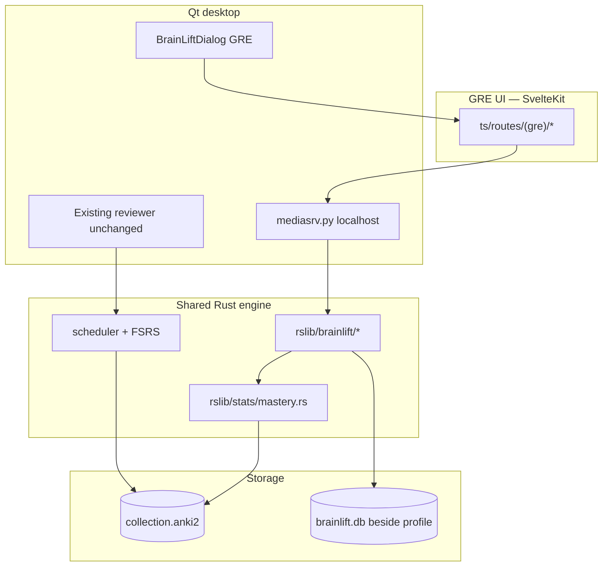

# BrainLift GRE — Release & Build Guide

This fork extends Anki with a **GRE study product** (BrainLift) built on the same engine. The desktop app ships GRE dashboards, practice mode, study planning, and readiness calibration alongside the standard Anki reviewer.

## What ships in the desktop app

| Feature | Route | Entry point |
| ------- | ----- | ----------- |
| Dashboard | `/dashboard` | **GRE → Open GRE** (Qt menu) |
| Memory review | `/review` | GRE shell → Review tab |
| Practice | `/practice` | GRE shell → Practice tab |
| Study plan | `/study-plan` | GRE shell → Study plan tab |
| Readiness & calibration | `/readiness` | GRE shell → Readiness tab |

After finishing Anki reviews, the congrats screen offers links to **GRE Practice** and **GRE Dashboard**.

## Architecture (high level)



**Rules enforced in code:**

- FSRS / `revlog` are never written from GRE practice attempts.
- Readiness **abstains** when evidence is insufficient (FSRS, studied cards, topic coverage, practice attempts).
- Performance and readiness calibration data live in `brainlift.db` (schema v3).

See also [brainlift-mobile.md](./brainlift-mobile.md) and [brainlift-architecture.md](./brainlift-architecture.md).

## Build from a clean checkout

Prerequisites match upstream Anki — see [development.md](./development.md#building-from-source).

```bash
# Clone and enter repo
git clone <repo-url> anki && cd anki

# Full format, build, and test (recommended before release)
just check
```

Quick iteration:

| Command | Purpose |
| ------- | ------- |
| `just build` | Build pylib + Qt (`./ninja pylib qt`) |
| `just run` | Dev build and launch Anki |
| `just run-optimized` | Release-optimized dev run |
| `just test-rust` | Rust tests only |
| `just test-py` | Python tests only |
| `just test-ts` | TypeScript / Svelte checks |
| `cargo check` | Rust-only compile check |

After changing `.proto` files:

```bash
touch proto/anki/brainlift.proto
./ninja rslib:proto ts:generated:proto pylib:anki:proto
just build
```

Generated outputs live under `out/` — never edit by hand.

## Verify the GRE UI in development

1. `just run`
2. **GRE → Open GRE** from the menu bar
3. Confirm dashboard, practice, study plan, and readiness pages load
4. Optional: finish a review session and use congrats links

Web assets are served at `http://127.0.0.1:40000/_anki/pages/` during dev (e.g. `dashboard.html`).

For live web reload while editing Svelte:

```bash
just web-watch   # separate terminal
just run
```

## Desktop installer

Build a redistributable installer (same process as upstream Anki):

```bash
tools/build-installer
# equivalent: RELEASE=2 ./ninja installer
```

Output directory: **`out/installer/dist/`**

| Platform | Artifact |
| -------- | -------- |
| macOS | `.dmg` |
| Windows | `.msi` |
| Linux | tarball |

Build logs: `out/installer/logs/`. Templates: `qt/installer/{mac,windows,linux}-template/`.

Verify locally before publishing:

1. `just check` passes
2. `tools/build-installer` completes without error
3. Install from `out/installer/dist/` and smoke-test **GRE → Open GRE**

Full public release workflow: [releasing.md](./releasing.md) and `just release::help`.

## Key source locations

```
proto/anki/brainlift.proto       BrainLiftService RPCs
rslib/src/brainlift/             GRE engine (scores, dashboard, calibration, storage)
pylib/anki/brainlift.py          Python Collection wrappers
qt/aqt/brainlift.py              GRE dialog + review handoff
qt/aqt/mediasrv.py               SvelteKit routes + API whitelist
ts/routes/(gre)/                 GRE Svelte pages
docs/brainlift-*.md              Architecture and release docs
```

## Release checklist

- [ ] `just check` green on release branch
- [ ] No untracked GRE source files (all `rslib/src/brainlift/*`, `ts/routes/(gre)/*` committed)
- [ ] Proto bindings regenerated after any `.proto` change
- [ ] Installer builds (`tools/build-installer`)
- [ ] Smoke test: GRE dialog, practice attempt, dashboard refresh after review
- [ ] Readiness abstention shows missing requirements when data is sparse
- [ ] Documentation updated for route and API changes
