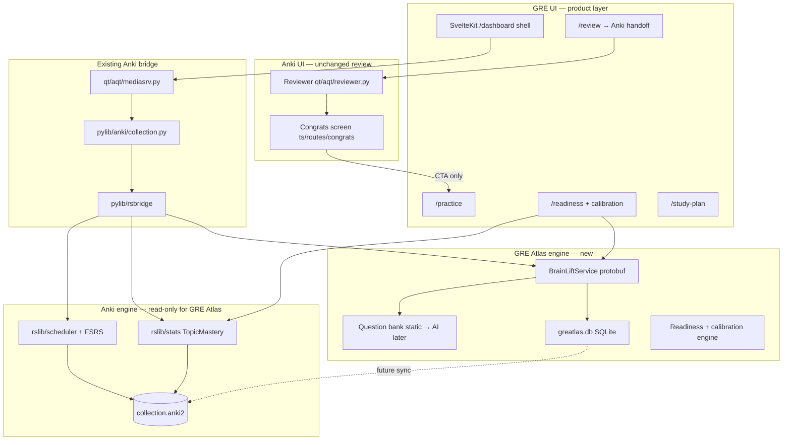
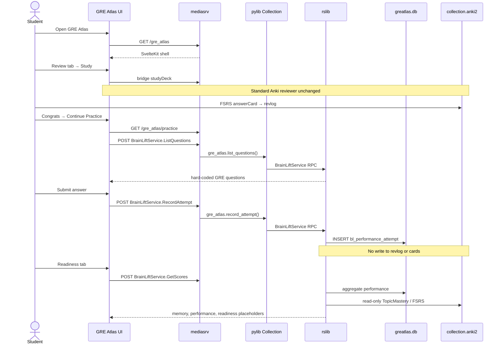
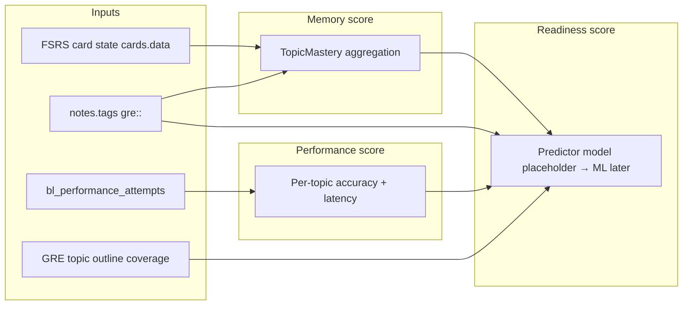

# GRE Atlas Product Architecture

**Status:** Phase 1 implemented on desktop (GRE shell, practice, dashboard, study plan, readiness + calibration)\
**Exam:** GRE\
**Positioning:** GRE Atlas is an AI-powered GRE study product. Anki’s scheduler and FSRS are the **memory engine** underneath. GRE Atlas is not “Anki with extra stats.”

**Build & release:** [gre-atlas-release.md](./gre-atlas-release.md)

### Implemented vs planned

| Area                                    | Status                                                                   |
| --------------------------------------- | ------------------------------------------------------------------------ |
| GRE Svelte shell (`ts/routes/(gre)/`)   | Done — `/dashboard`, `/practice`, `/study-plan`, `/readiness`, `/review` |
| `BrainLiftService` RPCs                 | Done — see `proto/anki/brainlift.proto`                                  |
| `greatlas.db` sidecar storage           | Done — schema v3                                                         |
| Memory / Performance / Readiness scores | Done — with abstention gates                                             |
| Study plan ranking                      | Done                                                                     |
| Readiness calibration (Brier, curve)    | Done                                                                     |
| Qt GRE menu + dialog                    | Done                                                                     |
| Congrats → Practice / Dashboard CTAs    | Done                                                                     |
| FTL / localized GRE strings             | Planned                                                                  |
| AI question generation                  | Phase 3                                                                  |
| iOS companion + sync                    | Phase 4                                                                  |

---

## 1. Architecture document

### 1.1 Product principles

| Principle                            | Meaning                                                                                                            |
| ------------------------------------ | ------------------------------------------------------------------------------------------------------------------ |
| **Memory ≠ Performance ≠ Readiness** | Three scores, three data sources, three computation paths                                                          |
| **FSRS is sacred**                   | Card ratings, `revlog`, scheduler state, and `cards.data` are never written from GRE practice                      |
| **Anki review stays Anki**           | `qt/aqt/reviewer.py` and the v3 scheduler path are unchanged                                                       |
| **GRE Atlas is a parallel workflow** | New navigation, new pages, new storage, new RPCs                                                                   |
| **Read-only memory reads**           | GRE Atlas may _read_ FSRS retrievability (existing `TopicMastery` work) but never back-propagates practice results |
| **Sync-ready from day one**          | Performance data lives in GRE Atlas-owned tables with USN/mod metadata, not in ad-hoc JSON blobs                   |

### 1.2 Layered system



### 1.3 Score ownership

| Score           | Owner                            | Inputs                                          | Phase 1                                      |
| --------------- | -------------------------------- | ----------------------------------------------- | -------------------------------------------- |
| **Memory**      | FSRS (via read-only aggregation) | Card retrievability, topic tags (`gre::`), reps | Wire to existing `StatsService.TopicMastery` |
| **Performance** | GRE Atlas                        | GRE question attempts (separate table)          | Hard-coded questions + attempt logging       |
| **Readiness**   | GRE Atlas predictor              | Memory + Performance + topic coverage           | Placeholder composite; real model later      |

**Contamination guard:** `RecordPerformanceAttempt` writes only to `greatlas.db`. No code path from GRE Atlas practice into `answer_card`, `revlog`, or card ease/FSRS state.

### 1.4 Relationship to existing work

The repo already contains a **Topic Mastery Engine** prototype:

- `proto/anki/stats.proto` → `TopicMastery`
- `rslib/src/stats/mastery.rs`
- `ts/routes/readiness/` dev page

**Design decision:** Keep `TopicMastery` as the **memory signal** inside Anki’s stats layer. GRE Atlas product APIs move to a new `BrainLiftService` in `proto/anki/brainlift.proto`. The Readiness dashboard calls both:

- `BrainLiftService.GetScores` (performance + readiness + coverage)
- `StatsService.TopicMastery` (memory), or a thin wrapper in `BrainLiftService` that delegates

The old standalone `/readiness` dev route was replaced by `/readiness` inside the GRE shell (`ts/routes/(gre)/readiness/`).

### 1.5 Desktop integration model

GRE Atlas runs **inside the same Anki process** (forked repo) but presents as its own section:

1. **Qt:** Collection open enters the **GRE main shell** at `/home`. The **GRE modal dialog** (`GreAtlasDialog`) loads `/dashboard` via `open_gre_atlas()` or congrats CTAs. The menu bar exposes **GRE → Debug** only (no separate “Open GRE” item).
2. **Review handoff:** Congrats screen adds **Continue to GRE Practice** and **View GRE Dashboard**. Reviewer is unchanged.
3. **Review tab inside GRE:** “Review” nav starts Anki review for the **GRE Atlas** deck via bridge command.

---

## 2. Folder structure

New code lives in clearly named GRE Atlas namespaces. Anki upstream files get minimal, documented touch points.

```
anki/
├── proto/anki/
│   └── brainlift.proto              # NEW: BrainLiftService RPCs
│
├── rslib/src/gre_atlas/             # NEW: GRE Atlas domain
│   ├── mod.rs
│   ├── storage/
│   │   ├── mod.rs
│   │   ├── schema.sql               # greatlas.db DDL
│   │   ├── attempts.rs              # CRUD performance attempts
│   │   └── questions.rs             # static question bank (Phase 1)
│   ├── service.rs                   # protobuf impl
│   ├── scores.rs                    # memory/performance/readiness aggregation
│   └── questions/
│       └── seed_gre.json            # hard-coded GRE items (Phase 1)
│
├── pylib/anki/
│   └── gre_atlas.py                 # NEW: Collection.gre_atlas_* wrappers
│
├── qt/aqt/
│   ├── gre_atlas.py                 # NEW: GreAtlasDialog, menu registration
│   └── mediasrv.py                  # extend: sveltekit pages + RPC whitelist
│
├── ts/
│   ├── routes/gre_atlas/            # NEW: product shell + pages
│   │   ├── +layout.svelte           # GRE Atlas nav + branding
│   │   ├── +layout.ts               # i18n bootstrap
│   │   ├── review/+page.svelte      # launches Anki study (bridge)
│   │   ├── practice/
│   │   │   ├── +page.svelte
│   │   │   └── +page.ts
│   │   ├── readiness/+page.svelte
│   │   └── study-plan/+page.svelte  # placeholder
│   ├── lib/gre_atlas/               # NEW: shared components
│   │   ├── nav/
│   │   ├── practice/
│   │   └── scores/
│   └── routes/congrats/
│       └── CongratsPage.svelte      # ONLY Anki touch: GRE Atlas CTA button
│
├── docs/
│   ├── gre-atlas-architecture.md    # existing codebase map (reference)
│   └── gre-atlas-product-architecture.md  # this document
│
└── ftl/core/
    └── gre_atlas.ftl                # NEW: product strings (not Anki stats strings)
```

**Files intentionally not modified in Phase 1:** `reviewer.py`, `rslib/scheduler/*`, `rslib/src/storage/schema11.sql`, revlog writers.

---

## 3. Data flow diagram

### 3.1 End-to-end vertical slice (Phase 1)



### 3.2 Score computation flow (target state)



---

## 4. Storage design

### 4.1 Two-database model

| Database           | Path                         | Purpose                                                    |
| ------------------ | ---------------------------- | ---------------------------------------------------------- |
| `collection.anki2` | `{profile}/collection.anki2` | Anki cards, notes, revlog, FSRS — **GRE Atlas read-only**  |
| `greatlas.db`      | `{profile}/greatlas.db`      | GRE Atlas-owned performance, sessions, future AI artifacts |

**Why sidecar DB:** Keeps GRE assessment data out of Anki’s sync merge logic until GRE Atlas sync is designed. Avoids schema 19 fights with upstream. Clear audit boundary for “never contaminate FSRS.”

**Collection binding:** `bl_meta.collection_path` stores absolute path to the active `collection.anki2` so mobile/desktop can validate pairing.

### 4.2 Schema (`greatlas.db`)

```sql
-- meta / migration
CREATE TABLE bl_meta (
  key TEXT PRIMARY KEY,
  val TEXT NOT NULL
);
-- keys: schema_version, collection_path, collection_crt

CREATE TABLE bl_question (
  id TEXT PRIMARY KEY,           -- stable slug, e.g. "gre-quant-pct-001"
  topic TEXT NOT NULL,           -- e.g. "gre::quant::arithmetic::percent"
  section TEXT NOT NULL,         -- verbal | quant
  format TEXT NOT NULL,          -- mcq | text_completion | rc | quant | data_interp
  stem TEXT NOT NULL,
  choices_json TEXT,             -- JSON array for MCQ; null for numeric entry
  correct_answer TEXT NOT NULL,
  explanation TEXT NOT NULL,
  difficulty REAL,               -- 0..1 optional
  usn INTEGER NOT NULL DEFAULT 0,
  mtime_secs INTEGER NOT NULL
);

CREATE TABLE bl_performance_attempt (
  id INTEGER PRIMARY KEY,
  question_id TEXT NOT NULL REFERENCES bl_question(id),
  topic TEXT NOT NULL,
  answered_at_secs INTEGER NOT NULL,
  answer TEXT NOT NULL,
  correct INTEGER NOT NULL,      -- 0/1
  response_time_ms INTEGER NOT NULL,
  confidence INTEGER,            -- 1-5 optional, null allowed
  session_id TEXT,               -- groups post-review practice
  usn INTEGER NOT NULL DEFAULT -1,
  mtime_secs INTEGER NOT NULL
);

CREATE INDEX ix_bl_attempt_topic ON bl_performance_attempt(topic);
CREATE INDEX ix_bl_attempt_time ON bl_performance_attempt(answered_at_secs);
CREATE INDEX ix_bl_attempt_usn ON bl_performance_attempt(usn);
```

**Phase 1 seeding:** On first open, Rust migrates schema and inserts ~5–10 hard-coded rows from `seed_gre.json` into `bl_question` if table empty.

### 4.3 Performance attempt record (protobuf ↔ row)

| Field         | Storage                                     |
| ------------- | ------------------------------------------- |
| question id   | `question_id`                               |
| topic         | `topic` (denormalized for fast aggregation) |
| timestamp     | `answered_at_secs`                          |
| answer        | `answer`                                    |
| correct       | `correct`                                   |
| response time | `response_time_ms`                          |
| confidence    | `confidence` (optional)                     |

### 4.4 Future sync (not Phase 1)

Design hooks only:

- `usn` / `mtime_secs` on mutable GRE Atlas rows mirror Anki’s pattern
- Future `GreAtlasSyncService` exchanges `bl_*` increments separately from AnkiWeb sync
- Mobile companion reads same protobuf RPCs; local `greatlas.db` on device
- Conflict rule (draft): latest `answered_at_secs` wins per attempt id; attempts are append-mostly

### 4.5 What we explicitly do not do

- No rows in `revlog` for practice
- No `answer_card` calls from practice
- No custom fields in `cards.data` for GRE results
- No deck/config keys that FSRS reads

---

## 5. UI wireframe

### 5.1 GRE Atlas shell (all pages)

```
┌─────────────────────────────────────────────────────────────┐
│  ◆ GRE Atlas                              [profile] [sync]  │
├──────────┬──────────────────────────────────────────────────┤
│ Review   │                                                  │
│ Practice │   <main content>                                 │
│ Readiness│                                                  │
│ Study Plan│                                                 │
└──────────┴──────────────────────────────────────────────────┘
```

Branding: distinct header color/wordmark (“GRE Atlas”, not “Anki”). Reuse Anki design tokens (`base.scss`) for accessibility, but separate layout component.

### 5.2 Review (`/gre_atlas/review`)

```
┌────────────────────────────────────────┐
│  Memory review                         │
│  Finish your scheduled cards in Anki.  │
│                                        │
│  [ Start review ]  → existing Anki flow│
│                                        │
│  Due today: 42 reviews · 8 new         │
└────────────────────────────────────────┘
```

### 5.3 Practice (`/gre_atlas/practice`) — Phase 1

```
┌────────────────────────────────────────┐
│  Practice · Quantitative reasoning     │
│  Topic: gre::quant::arithmetic::percent│
├────────────────────────────────────────┤
│  A store marks down a $80 item by 25%. │
│  What is the sale price?               │
│                                        │
│  ○ $55   ○ $60   ● $65   ○ $70         │
│                                        │
│  Confidence: [1][2][3][4][5] optional  │
│                                        │
│  [ Submit ]                            │
└────────────────────────────────────────┘

        ─── after submit ───

┌────────────────────────────────────────┐
│  ✓ Correct · 12.4s                     │
│  Explanation: 25% off → $20 discount…  │
│  [ Next question ]  [ Back to Readiness] │
└────────────────────────────────────────┘
```

### 5.4 Readiness (`/gre_atlas/readiness`) — Phase 1 placeholders

```
┌────────────────────────────────────────┐
│  Your GRE readiness                    │
├──────────────┬──────────────┬───────────┤
│ Memory       │ Performance  │ Readiness │
│   72%        │   58%        │   —       │
│ FSRS topics  │ 3/5 today    │ Phase 2   │
├──────────────┴──────────────┴───────────┤
│  Recent practice                        │
│  • Percent discount — correct, 12s      │
│  • RC inference — incorrect, 45s      │
└────────────────────────────────────────┘
```

### 5.5 Study Plan — Phase 1 stub

```
┌────────────────────────────────────────┐
│  Study plan                            │
│  Coming soon: ranked topics based on    │
│  memory gaps and practice misses.       │
└────────────────────────────────────────┘
```

### 5.6 Anki congrats handoff (only Anki UI change)

```
┌────────────────────────────────────────┐
│  Congratulations! Finished for now.    │
│  …existing Anki messages…              │
│                                        │
│  [ Continue to GRE Atlas Practice ]    │  ← NEW primary CTA
│  [ Custom study ] …                    │
└────────────────────────────────────────┘
```

---

## 6. Protobuf API (BrainLiftService)

New file `proto/anki/brainlift.proto`:

```protobuf
service BrainLiftService {
  rpc ListQuestions(ListQuestionsRequest) returns (ListQuestionsResponse);
  rpc RecordAttempt(RecordAttemptRequest) returns (RecordAttemptResponse);
  rpc GetScores(GetScoresRequest) returns (GetScoresResponse);
  rpc GetRecentAttempts(GetRecentAttemptsRequest) returns (GetRecentAttemptsResponse);
}
```

Phase 1 behavior:

| RPC                 | Behavior                                                                                                                    |
| ------------------- | --------------------------------------------------------------------------------------------------------------------------- |
| `ListQuestions`     | Return seeded MCQ items; filter by `topic_prefix` / `limit`                                                                 |
| `RecordAttempt`     | Insert into `bl_performance_attempt`; return `{ correct, explanation }`                                                     |
| `GetScores`         | Memory from delegated TopicMastery; Performance from attempt aggregates; Readiness = placeholder (`sufficient_data: false`) |
| `GetRecentAttempts` | Last N attempts for dashboard list                                                                                          |

Register in backend codegen same as other services. Expose via `mediasrv` `exposed_backend_list` + localhost whitelist.

---

## 7. Step-by-step implementation plan

### Phase 0 — Design approval (now)

- [ ] Review this document
- [ ] Confirm sidecar `greatlas.db` vs shared-schema tradeoff
- [ ] Confirm congrats-only Anki UI touch is acceptable

### Phase 1 — Minimum vertical slice (implement after approval)

**Goal:** Student can open GRE Atlas → review in Anki → get one hard-coded GRE question after congrats → submit → see result on Readiness dashboard. Everything compiles.

| Step | Work                                                                                                                  | Est. |
| ---- | --------------------------------------------------------------------------------------------------------------------- | ---- |
| 1.1  | Add `proto/anki/brainlift.proto`; codegen; stub `BrainLiftService` in rslib                                           | S    |
| 1.2  | Create `rslib/src/gre_atlas/storage/` + `schema.sql`; open `greatlas.db` beside profile                               | M    |
| 1.3  | Seed ~5 hard-coded questions; implement `ListQuestions`, `RecordAttempt`                                              | M    |
| 1.4  | Implement `GetScores` (memory delegates to `compute_topic_mastery`; performance from attempts; readiness placeholder) | M    |
| 1.5  | `pylib/anki/gre_atlas.py` wrappers on `Collection`                                                                    | S    |
| 1.6  | mediasrv: register routes `gre_atlas`, `gre_atlas/practice`, etc.; expose RPCs                                        | S    |
| 1.7  | SvelteKit `ts/routes/gre_atlas/` shell + 4 nav pages                                                                  | M    |
| 1.8  | Practice page: fetch question, timer, submit, show explanation                                                        | M    |
| 1.9  | Readiness page: three score cards + recent attempts                                                                   | S    |
| 1.10 | Qt `GreAtlasDialog` + menu entry; `load_sveltekit_page("gre_atlas")`                                                  | S    |
| 1.11 | Congrats CTA → `/gre_atlas/practice` (single button + link)                                                           | S    |
| 1.12 | Rust unit tests: attempt insert, score aggregation; pylib smoke test                                                  | S    |
| 1.13 | `just check` green                                                                                                    | S    |

**Phase 1 exit criteria**

- [ ] `./run` → GRE Atlas menu opens product shell
- [ ] Review tab starts normal Anki review; no reviewer diffs
- [ ] After finishing reviews, congrats shows GRE Atlas Practice CTA
- [ ] Practice shows ≥1 seeded GRE MCQ; submit stores attempt in `greatlas.db` only
- [ ] Readiness shows Memory (from FSRS/topics), Performance (from attempts), Readiness placeholder
- [ ] `grep revlog` / scheduler: zero writes from GRE Atlas practice path

### Phase 2 — Readiness model + Study Plan (later)

- GRE topic outline JSON; coverage denominator
- Readiness predictor v1 (rules-based)
- Study Plan ranking RPC
- Replace placeholder Readiness score

### Phase 3 — AI generation (later)

- `GenerateQuestion` RPC behind provider interface
- Prompt templates per format (MCQ, TC, RC, quant)
- Human review queue / caching in `bl_question`

### Phase 4 — Mobile + sync (later)

- iOS shell calling same protobuf RPCs
- `GreAtlasSyncService` for `greatlas.db`
- Offline attempt queue on mobile

---

## 8. Risk register

| Risk                          | Mitigation                                                                   |
| ----------------------------- | ---------------------------------------------------------------------------- |
| GRE Atlas feels like Anki     | Dedicated `/gre_atlas` shell, branding, product copy in `gre_atlas.ftl`      |
| Accidental FSRS contamination | Separate DB; code review checklist; tests assert no `revlog` writes          |
| API 403 in external browser   | Whitelist GRE Atlas RPCs on localhost (same as stats dev pages)              |
| Upstream Anki merge pain      | GRE Atlas code isolated under `rslib/src/gre_atlas/`, `ts/routes/gre_atlas/` |
| TopicMastery in stats.proto   | Acceptable as memory read; GRE Atlas-facing API still `BrainLiftService`     |

---

## 9. Open questions for approval

1. **Sidecar DB:** Confirm `{profile}/greatlas.db` vs new tables in `collection.anki2` (schema 19).
2. **Congrats CTA:** Always show, or only when GRE-tagged deck / GRE Atlas enabled setting?
3. **Review inside GRE Atlas:** Launch current deck study, or force a specific “GRE deck”?
4. **Existing `/readiness` dev page:** Remove or redirect to `/gre_atlas/readiness`?

---

_Next step: approve this design, then implement Phase 1 only._
