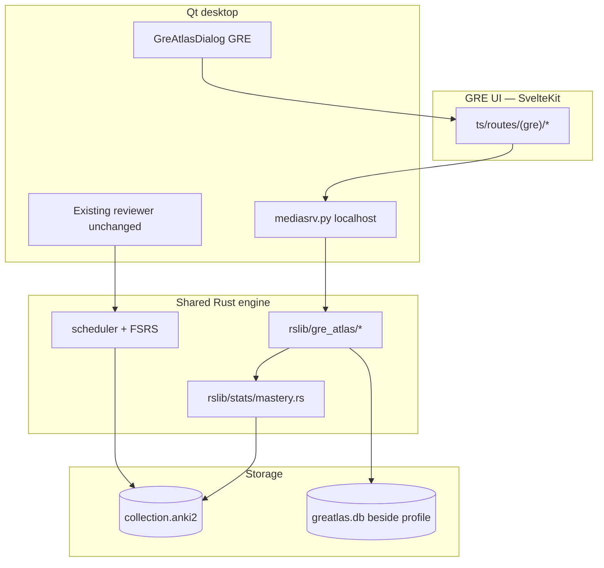

# GRE Atlas — Release & Build Guide

This fork extends Anki with a **GRE study product** (GRE Atlas) built on the same engine. The desktop app ships GRE dashboards, practice mode, study planning, and readiness calibration alongside the standard Anki reviewer.

## What ships in the desktop app

| Feature                  | Route         | Entry point                                          |
| ------------------------ | ------------- | ---------------------------------------------------- |
| Home / daily mission     | `/home`       | Collection open → GRE main shell                     |
| Full analytics dashboard | `/dashboard`  | GRE modal dialog (`open_gre_atlas`) or congrats CTAs |
| Memory review            | `/review`     | GRE shell → Study (starts reviewer)                  |
| Practice                 | `/practice`   | GRE shell header → Practice                          |
| Study plan               | `/study-plan` | In-page links from home / progress                   |
| Readiness & calibration  | `/readiness`  | In-page links from progress                          |

After finishing Anki reviews, the congrats screen offers links to **GRE Practice** and **GRE Dashboard**.

## Architecture (high level)



**Rules enforced in code:**

- FSRS / `revlog` are never written from GRE practice attempts.
- Readiness **abstains** when evidence is insufficient (FSRS, studied cards, topic coverage, practice attempts).
- Performance and readiness calibration data live in `greatlas.db` beside the profile (legacy `greatlas.db` is migrated on open; schema v4).

See also [gre-atlas-mobile.md](./gre-atlas-mobile.md) and [gre-atlas-architecture.md](./gre-atlas-architecture.md).

## Build from a clean checkout

Prerequisites match upstream Anki — see [development.md](./development.md#building-from-source).

```bash
# Clone and enter repo
git clone <repo-url> anki && cd anki

# Full format, build, and test (recommended before release)
just check
```

Quick iteration:

| Command              | Purpose                               |
| -------------------- | ------------------------------------- |
| `just build`         | Build pylib + Qt (`./ninja pylib qt`) |
| `just run`           | Dev build and launch Anki             |
| `just run-optimized` | Release-optimized dev run             |
| `just test-rust`     | Rust tests only                       |
| `just test-py`       | Python tests only                     |
| `just test-ts`       | TypeScript / Svelte checks            |
| `cargo check`        | Rust-only compile check               |

After changing `.proto` files:

```bash
touch proto/anki/brainlift.proto
./ninja rslib:proto ts:generated:proto pylib:anki:proto
just build
```

Generated outputs live under `out/` — never edit by hand.

## Verify the GRE UI in development

1. `just run`
2. Collection opens into the **GRE main shell** at `/home`
3. Confirm home, practice, study plan, and readiness pages load (via header nav or in-page links)
4. Optional: finish a review session and use congrats links (opens GRE modal at `/dashboard`)

Web assets are served at `http://127.0.0.1:40000/_anki/pages/` during dev (e.g. `dashboard.html`).

For live web reload while editing Svelte:

```bash
just web-watch   # separate terminal
just run
```

## Desktop installer

Build a redistributable installer (same process as upstream Anki):

```bash
tools/build-installer
# equivalent: RELEASE=2 ./ninja installer
```

Output directory: **`out/installer/dist/`**

| Platform | Artifact |
| -------- | -------- |
| macOS    | `.dmg`   |
| Windows  | `.msi`   |
| Linux    | tarball  |

Build logs: `out/installer/logs/`. Templates: `qt/installer/{mac,windows,linux}-template/`.

Verify locally before publishing:

1. `just check` passes
2. `tools/build-installer` completes without error
3. Install from `out/installer/dist/` and smoke-test GRE shell at `/home` plus one practice attempt

**Clean-machine install steps:** [gre-atlas-submission/INSTALL.md](./gre-atlas-submission/INSTALL.md)

**Full release checklist (desktop + iOS + Wednesday deliverables):** [gre-atlas-submission/RELEASE-CHECKLIST.md](./gre-atlas-submission/RELEASE-CHECKLIST.md)

Full public release workflow: [releasing.md](./releasing.md) and `just release::help`.

## Key source locations

```
proto/anki/brainlift.proto       BrainLiftService RPCs
rslib/src/gre_atlas/             GRE engine (scores, dashboard, calibration, storage)
pylib/anki/gre_atlas.py          Python Collection wrappers
qt/aqt/gre_atlas.py              GRE dialog + review handoff
qt/aqt/mediasrv.py               SvelteKit routes + API whitelist
ts/routes/(gre)/                 GRE Svelte pages
docs/gre-atlas-*.md              Architecture and release docs
```

## Release checklist

See the full matrix in [gre-atlas-submission/RELEASE-CHECKLIST.md](./gre-atlas-submission/RELEASE-CHECKLIST.md). Summary:

- [ ] `just check` green on release branch
- [ ] `just eval-gre-atlas-ai` passes (AI release gate on held-out gold set)
- [ ] No untracked GRE source files (all `rslib/src/gre_atlas/*`, `ts/routes/(gre)/*` committed)
- [ ] Proto bindings regenerated after any `.proto` change
- [ ] Installer builds (`tools/build-installer`) → artifact in `out/installer/dist/`
- [ ] Clean-machine install smoke test ([INSTALL.md](./gre-atlas-submission/INSTALL.md))
- [ ] iOS companion builds ([mobile/ios/README.md](../mobile/ios/README.md))
- [ ] Smoke test: GRE dialog, practice attempt, dashboard refresh after review
- [ ] Readiness abstention shows missing requirements when data is sparse
- [ ] Documentation updated for route and API changes
