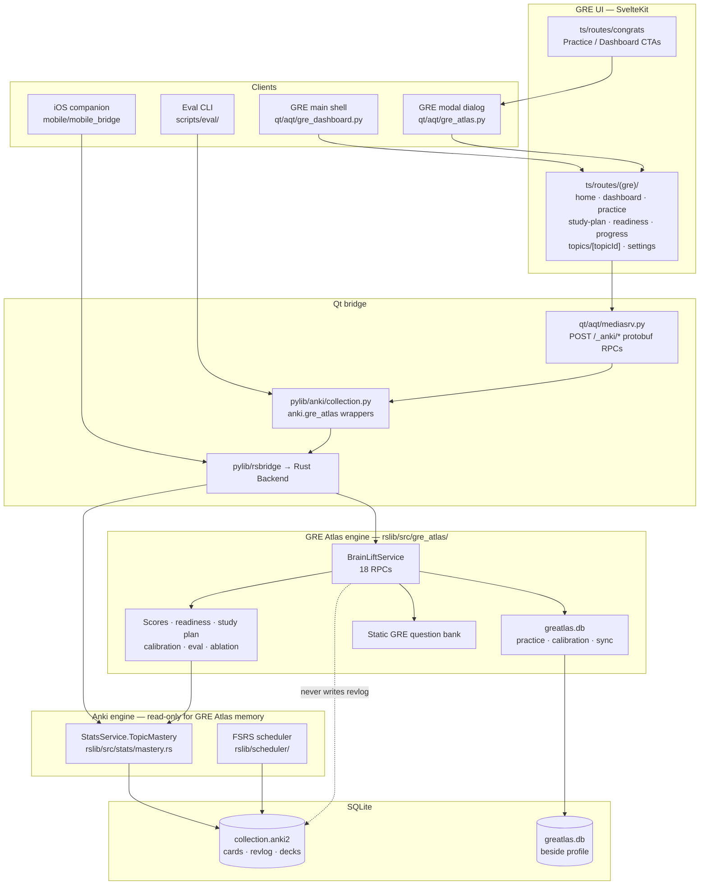
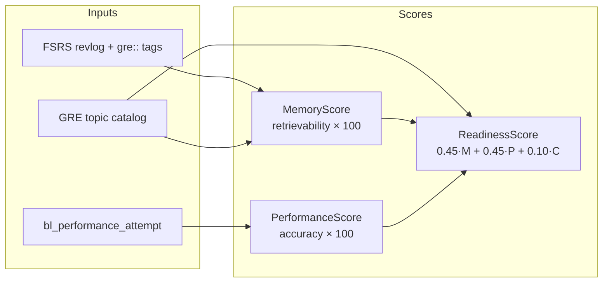
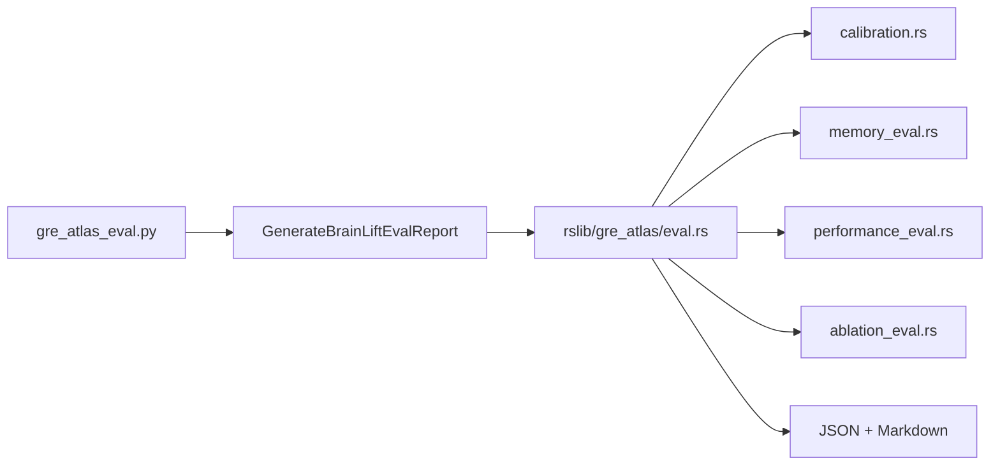

# GRE Atlas — architecture

## System diagram



## Layer responsibilities

| Layer                         | Responsibility                                             | GRE Atlas rule                                                 |
| ----------------------------- | ---------------------------------------------------------- | -------------------------------------------------------------- |
| **GRE UI**                    | Product pages, navigation, abstention UX                   | Calls `@generated/backend` RPCs only                           |
| **mediasrv**                  | Protobuf over HTTP to Rust                                 | Whitelists GRE RPCs for embedded webview                       |
| **BrainLiftService**          | Practice, scores, dashboard, study plan, calibration, eval | Writes **only** `greatlas.db` (+ deck/card ops for flashcards) |
| **StatsService.TopicMastery** | FSRS retrievability by `gre::` tags                        | Read-only on `collection.anki2`                                |
| **Reviewer**                  | Standard Anki review                                       | Unchanged; GRE deck returns to GRE shell after review          |

## Score pipeline



**Abstention:** Memory requires FSRS + ≥50 studied GRE cards + ≥50% weighted catalog coverage. Performance requires ≥50 practice attempts. Readiness requires both.

## RPC surface

### BrainLiftService (`proto/anki/brainlift.proto`)

| RPC                                    | Purpose                                          |
| -------------------------------------- | ------------------------------------------------ |
| `ListQuestions` / `GetQuestion`        | GRE practice bank                                |
| `CreateSession` / `RecordAttempt`      | Practice sessions (→ `greatlas.db` only)         |
| `GetScores`                            | Memory + performance + readiness + estimated GRE |
| `GetDashboard`                         | Full dashboard state + recent activity           |
| `GetRecentAttempts`                    | Attempt history filter                           |
| `GetGreStudyStatus`                    | Deck existence, due counts                       |
| `GetStudyPlan`                         | Ranked recommendations + daily plan              |
| `GetReadinessCalibration`              | Live readiness + calibration stats               |
| `GetTopicDetails`                      | Per-topic drill-down                             |
| `GenerateBrainLiftEvalReport`          | Read-only eval JSON + Markdown                   |
| `GenerateBrainLiftAiEvalReport`        | Read-only AI gold-set eval                       |
| `GenerateQuestion`                     | Template MCQ from ETS source (optional persist)  |
| `GetBrainLiftSyncStatus` / Pull / Push | Mobile `greatlas.db` sync                        |
| `PrepareDemoCollection`                | Idempotent demo seed (mobile / tests)            |

### StatsService

| RPC            | Purpose                                      |
| -------------- | -------------------------------------------- |
| `TopicMastery` | FSRS retrievability aggregation for GRE tags |

## Navigation model (desktop)

| Surface                 | Default route                                  | Notes                                                                                                        |
| ----------------------- | ---------------------------------------------- | ------------------------------------------------------------------------------------------------------------ |
| Main GRE shell          | `/home`                                        | Opened on collection load (`greDashboard` state); header nav: Dashboard, Study, Practice, Progress, Settings |
| Modal GRE dialog        | `/dashboard`                                   | Congrats CTAs, `open_gre_atlas()`                                                                            |
| Toolbar (outside shell) | `/home`, `/practice`, `/progress`, `/settings` | Quick links back into shell                                                                                  |

Both hosts load the same SvelteKit route tree under `ts/routes/(gre)/`.

The Qt menu bar has **GRE → Debug** only (Deck Browser, Browse, Add, Stats, Sync). Collection open is the primary GRE entry — there is no separate “Open GRE” menu item.

## Evaluation architecture



Held-out rule everywhere: **`id % 5 == 0`** (predictions, attempts, revlog).

## Source index

```
proto/anki/brainlift.proto
rslib/src/gre_atlas/          # engine
rslib/src/stats/mastery.rs    # memory signal
pylib/anki/gre_atlas.py       # Python API
qt/aqt/gre_dashboard.py       # main shell
qt/aqt/gre_atlas.py           # modal + bridge commands
qt/aqt/mediasrv.py            # HTTP RPC whitelist
ts/routes/(gre)/              # GRE UI
scripts/eval/                 # eval + benchmark CLI
docs/models/                  # model specifications
```
